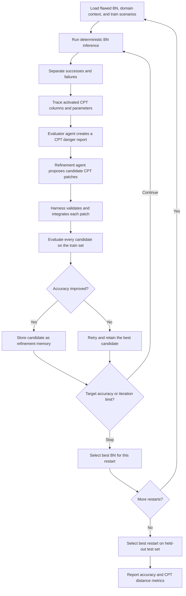

# AgentBN

An agentic framework for diagnosing and repairing the conditional probability tables (CPTs) of deployed Bayesian Networks (BNs).

A **Bayesian Network** is a probabilistic graphical model that represents variables and their conditional dependencies as a directed acyclic graph. Each node represents a variable—such as a symptom, equipment condition, or possible failure—while each directed edge represents a dependency between variables. CPTs quantify the strength of these relationships.

BNs are particularly valuable in **safety-critical and high-stakes domains**, including power and energy systems, healthcare, manufacturing, industrial automation, cybersecurity, and chemical engineering. They support tasks such as root-cause analysis, fault diagnosis, and medical diagnosis by reasoning under uncertainty. Given observed evidence—such as abnormal sensor readings, equipment alarms, process deviations, or patient symptoms—a BN updates the probabilities of possible underlying causes. This allows likely faults, failures, or diagnoses to be ranked even when the available evidence is incomplete, noisy, or uncertain. Their explicit graphical structure also makes BNs more interpretable than many black-box predictive models. Domain experts can inspect modeled relationships, trace how evidence influences a conclusion, and incorporate expert knowledge when historical data is limited.

However, a BN that performed well during development may become unreliable after deployment. Even when the network structure remains valid, outdated or miscalibrated probabilities may lead to incorrect diagnoses and root-cause predictions.

**AgentBN focuses on this post-deployment setting.** It uses labeled operational scenarios to identify recurring inference failures and localize the CPT parameters most plausibly associated with them. An LLM then proposes constrained CPT patches, while a deterministic evaluation harness validates every candidate, controls acceptance, manages retries, and records the complete refinement process.

The goal is to improve a deployed BN without rebuilding the entire model or allowing the LLM to modify it without evidence. The LLM proposes; the harness measures, gates, retries, and records.

## Engineering Highlights

AgentBN is designed as an end-to-end agentic AI system rather than a standalone LLM prompt. It combines probabilistic reasoning, specialized agents, structured context, and a deterministic control harness to support evidence-driven, post-deployment Bayesian Network repair.

- **[Multi-agent workflow](#agent-architecture):** Separates failure diagnosis from CPT refinement. The evaluator agent identifies plausible failure sources, while the refinement agent generates targeted repair candidates.

- **[Context engineering](#context-engineering):** Builds task-specific context from domain knowledge, Bayesian Network structure, inference traces, failure statistics, prior proposals, and experiment history.

- **[Prompt engineering](#prompt-engineering):** Uses role-specific prompts, explicit reasoning criteria, constrained CPT-editing instructions, and strict JSON output contracts.

- **[Harness engineering](#harness-engineering):** Controls the agent lifecycle through schema validation, deterministic evaluation, acceptance gates, bounded retries, output repair, state management, and logging.

- **[Deterministic verification](#pipeline):** Keeps numerical inference and candidate selection outside the LLM. Every proposed repair is evaluated against labeled scenarios.

- **[Reflection and memory](#context-engineering):** Preserves accepted networks and diagnostic results across refinement iterations.

- **[Post-deployment focus](#objective):** Repairs flawed, outdated, or miscalibrated CPT parameters after deployment.

- **[Evaluation-driven development](#outputs):** Measures prediction accuracy and CPT similarity using KL divergence, RMSE, Hellinger distance, and CPT-change analysis.

## Objective

AgentBN investigates whether an agentic refinement loop can perform **flawed CPT localization** and **evidence-driven repair** of deployed Bayesian Networks while preserving their structure and probabilistic validity.

Given:

- a deployed BN with one or more flawed or miscalibrated CPTs;
- domain context describing the variables and their relationships;
- labeled training scenarios used for agent-guided diagnosis and refinement;
- inference results, activation traces, and failure diagnostics derived from the flawed BN and supplied to the agents as context;
- held-out testing scenarios used to evaluate the repaired BN; and
- a target node whose predictions are evaluated.

the framework attempts to:

1. detect recurring inference failures from labeled operational scenarios;
2. localize the CPTs and parameters most plausibly responsible for those failures;
3. generate focused, probabilistically valid CPT repair candidates;
4. improve scenario-level prediction accuracy through iterative refinement; and
5. compare the repaired BN with a ground-truth network using CPT-level distance metrics.

The current benchmarks are:

| Benchmark | Domain | Target Node | Total Nodes | Flawed CPTs | Flawed BN Accuracy (Train / Test) | Proposed BN Accuracy (Train / Test) | Accuracy Improvement (Train / Test) |
|-----------|--------|-------------|------------:|------------:|-----------------------------------|-------------------------------------|-------------------------------------|
| `der` | Distributed energy resource anomaly diagnosis | `Root_Causes` | 20 | 2 | 68.06 % / 70 % |  80.55 % / 80 % | 12.49 % / 10 % |
| `lung_cancer` | Asia lung-cancer network | `either` | 8 | 1 | 75.0 % / 66.67 % | 100 % / 100 % | 25 % /  33.33 %|
| `alarm` | Clinical monitoring / ALARM network | `HYPOVOLEMIA` | 37 | 2 | 88.0 % / 61.54 % | 100 % / 100 % | 12 % / 39.46 % |

## Pipeline



### 1. Initialize

The orchestrator loads the selected benchmark, flawed BN, ground-truth BN, domain context, and train/test scenario files. It evaluates the flawed BN and computes an initial acceptance threshold:

```text
flawed_accuracy + INITIAL_IMPROVEMENT_RATIO × (1 - flawed_accuracy)
```

### 2. Diagnose

The evaluator builds the BN with `pgmpy`, runs inference, and records which CPT column and child state were activated for each relevant node. It aggregates those traces into failure and success weights and detects recurring cross-CPT activation patterns.

### 3. Localize

The evaluator agent receives the deterministic statistics, full BN, and domain context. It returns a structured danger report that ranks plausible CPT refinement targets and suggests adjustment directions. Deterministic evidence narrows the search space before the LLM is asked to reason.

### 4. Generate and select

The refinement agent receives the best accepted BN, its analysis record, domain context, target node, and inference thresholds. It proposes one or more CPT-only patches. The harness:

- validates the structured response;
- integrates each patch into a copy of the baseline BN;
- evaluates every candidate with deterministic inference; and
- selects the candidate with the fewest failures, breaking ties by accuracy.

### 5. Reflect and retry

Accepted BNs and their analyses become episodic memory for later iterations. If a candidate does not improve accuracy, it is removed from proposal memory and regenerated up to the configured retry limit. Each restart raises the LLM temperature slightly to diversify the search.

### 6. Validate

The best BN from each restart is retained. After all restarts, the harness evaluates each restart winner on the held-out test set and selects the result with the fewest failures. It then compares repaired CPTs with the ground truth using:

- Kullback–Leibler divergence;
- root mean squared error (RMSE);
- Hellinger distance; and
- expected-versus-observed CPT change analysis.

## Agent architecture

### Evaluator agent

Implemented in `agents/bn_evaluator.py`.

Its role is diagnostic, not generative. It combines deterministic activation traces with domain reasoning to produce a focused CPT danger report. This separation prevents the generator from changing arbitrary parts of the network without evidence.

### Refinement agent

Implemented in `agents/bn_generator_reflexion.py`.

It selects the best analyzed BN as its baseline, consumes the evaluator's diagnosis, and proposes localized CPT patches. It does not choose the winning candidate: candidate selection is delegated to the deterministic evaluation harness.

### Orchestrator

Implemented in `orchestration_pipeline.py`.

The orchestrator owns experiment state, initial acceptance, iterative refinement, retry policy, restarts, train/test separation, and final validation. It is the control plane that turns the two LLM roles into a reproducible workflow.

## Context engineering

Context is deliberately layered instead of sending the entire experiment history to every model call.

| Context layer | Source | Purpose |
| --- | --- | --- |
| Domain memory | `prompts/<benchmark>/context_agent.txt` | Defines variable semantics and domain relationships |
| Structural state | Current BN JSON | Grounds reasoning in graph structure and CPT values |
| Diagnostic state | `workspace/<benchmark>/bn_analysis.json` | Carries accuracy and the latest danger report |
| Parameter evidence | Activation trace and failure statistics | Links failures to specific CPT columns and states |
| Episodic memory | `last_proposed_bn.jsonl` | Preserves accepted proposals across iterations |
| Restart memory | `restart_final_bns.jsonl`, `restart_bn_analysis.jsonl` | Separates independent search trajectories |
| Runtime constraints | Target node, confidence, margin, thresholds | Keeps generation aligned with the experiment contract |

This design gives the LLM the smallest useful evidence bundle while keeping numerical inference, candidate scoring, and experiment state outside the model.

## Prompt engineering

The framework uses two principal prompt contracts:

- `prompts/ref_prompt.txt` instructs the refinement agent to return candidate CPT patches.
- The danger-report prompt in `agents/bn_evaluator.py` asks the evaluator to distinguish correlation from plausible independent contribution and return ranked refinement targets.

Prompt behavior is constrained through:

- explicit roles and task boundaries;
- domain context injection;
- definitions for every diagnostic statistic;
- stepwise reasoning criteria;
- strict JSON schemas;
- bounded output fields and enumerated labels;
- instructions to modify CPTs rather than the full network; and
- a separate temperature-zero formatting-repair prompt that may repair syntax but may not alter content.

Benchmark-specific context can be edited independently of the generic refinement prompt, allowing the same agent workflow to operate across domains.

## Harness engineering

The harness is responsible for correctness and control around probabilistic LLM output:

- **Deterministic scoring:** `pgmpy` inference, not model judgment, determines success.
- **Candidate tournaments:** every proposed patch is evaluated under the same scenarios.
- **Acceptance gates:** initial improvement and target-accuracy thresholds prevent unconditional adoption.
- **Bounded retries:** generation, no-improvement, JSON-format, and repair retries have explicit limits.
- **Schema validation:** malformed LLM responses are rejected before integration.
- **Content-preserving repair:** a separate call repairs JSON formatting at temperature `0.0`.
- **State isolation:** benchmark-specific workspaces prevent cross-experiment contamination.
- **Restart diversity:** independent runs use gradually higher temperatures.
- **Held-out selection:** restart winners are compared on the test set.
- **Artifact logging:** traces, diagnoses, proposals, restart winners, and CPT comparisons remain inspectable.

The central design principle is:

> Keep semantic hypothesis generation inside the agent; keep validation, state transitions, and acceptance decisions inside deterministic code.

## Repository structure

```text
AgentBN/
├── agents/
│   ├── bn_evaluator.py              # Failure localization agent
│   └── bn_generator_reflexion.py    # CPT refinement agent
├── config/
│   └── settings.py                  # Paths, benchmarks, and hyperparameters
├── datasets/
│   ├── alarm/
│   ├── der/
│   └── lung_cancer/                 # BN files and train/test scenarios
├── evaluation/
│   ├── automatic_bn_reasoning_old.py
│   ├── bn_validator.py              # Accuracy and CPT-distance validation
│   └── recall_style_heuristic_validator.txt
├── prompts/
│   ├── alarm/
│   ├── der/
│   ├── lung_cancer/                 # Benchmark-specific context
│   ├── ref_prompt.txt               # Refinement prompt contract
│   └── scenario_gen_prompt.txt
├── utils/                            # BN I/O, inference, JSON, and LLM helpers
├── workspace/                        # Generated experiment state
├── logs/                             # Captured run logs
├── orchestration_pipeline.py         # Main entry point
└── run.sh                            # Convenience runner
```

`legacy/` contains earlier pipeline implementations and is not used by the current orchestrator.

## Requirements

- Python 3.10 or newer
- An OpenAI API key
- Bash, if using `run.sh`

Python packages used by the current codebase:

```text
openai
langchain-core
pgmpy
pandas
numpy
scikit-learn
```

## Installation

```bash
git clone https://github.com/mohammad-shamim-ahsan/AgentBN.git
cd AgentBN

python3 -m venv .venv
source .venv/bin/activate

python3 -m pip install --upgrade pip
python3 -m pip install openai langchain-core pgmpy pandas numpy scikit-learn
```

Set the API key in your environment:

```bash
export OPENAI_API_KEY="your-api-key"
```

The model is configured in `utils/llm.py`. Ensure that your OpenAI project has access to the configured model before running an experiment.

## Usage

Run the default `alarm` benchmark:

```bash
./run.sh
```

Run a specific benchmark:

```bash
./run.sh alarm
./run.sh lung_cancer
./run.sh der
```

Run the orchestrator directly:

```bash
python3 orchestration_pipeline.py --benchmark alarm
```

Optionally constrain the training sample to a success-to-failure ratio:

```bash
python3 orchestration_pipeline.py --benchmark der --SFR 5
```

`--SFR 5`, for example, constructs a temporary training sample with five successful scenarios for every failure scenario.

## Dataset contract

Each benchmark directory is expected to provide:

```text
datasets/<benchmark>/
├── BN_gt.json
├── flawed_BN_0.json
├── combined_train_scenarios.csv
└── combined_test_scenarios.csv
```

Scenario CSVs must contain:

- `Scenario #`: unique scenario identifier;
- `Ground Truth`: expected target-node state; and
- one column for each observed evidence variable.

The target node, evidence nodes, expected changed CPTs, and validation scope must be defined for the benchmark in `config/settings.py`. A matching domain context file must exist at `prompts/<benchmark>/context_agent.txt`.

## Configuration

Key controls live in `config/settings.py`:

| Setting | Default | Meaning |
| --- | ---: | --- |
| `MAX_RESTARTS` | `3` | Independent refinement trajectories |
| `BASE_TEMPERATURE` | `0.2` | Initial LLM sampling temperature |
| `MAX_ITER` | `3` | Refinement iterations per restart |
| `MAX_INITIAL_RETRIES` | `3` | Attempts to clear the initial acceptance threshold |
| `INITIAL_IMPROVEMENT_RATIO` | `0.30` | Required fraction of remaining accuracy gap |
| `MAX_NO_IMPROVEMENT_RETRIES` | `3` | Regeneration attempts after a non-improving proposal |
| `MIN_CONFIDENCE` | `0.50` | Confidence constraint passed to refinement |
| `MIN_MARGIN` | `0.20` | Prediction-margin constraint passed to refinement |
| `TARGET_ACCURACY` | `0.98` | Early-stop accuracy |
| `MAX_FORMAT_RETRIES` | `3` | Structured-output generation attempts |
| `MAX_REPAIR_RETRIES` | `2` | JSON repair attempts |

## Outputs

Each run writes benchmark-specific artifacts under `workspace/<benchmark>/`:

| Artifact | Description |
| --- | --- |
| `activation_trace.csv` | Activated CPT columns and selected states per scenario |
| `failure_parameter_statistics.json` | Failure/success weights and recurring activation patterns |
| `dangerous_cpt_report.json` | Evaluator agent's ranked refinement targets |
| `bn_analysis.json` | Per-BN accuracy and diagnostic memory |
| `last_proposed_bn.jsonl` | Candidate BN history |
| `restart_final_bns.jsonl` | Best BN retained from each restart |
| `restart_bn_analysis.jsonl` | Diagnostic history grouped by restart |
| `cpt_comparison_analysis.json` | Expected and observed CPT-change comparison |

Console output is captured under `logs/<benchmark>/` when using `run.sh`.

> **Important:** the pipeline clears several workspace artifacts at the beginning of an experiment and at each restart. Copy results you want to preserve before starting another run for the same benchmark.

## Reproducibility and limitations

- Dataset sampling for `--SFR` uses a fixed random seed (`42`).
- LLM generation remains stochastic; restart temperature increases by `0.1` per restart.
- Generated JSON is schema-checked, but domain correctness still depends on the supplied context and evaluation scenarios.
- Final restart selection uses the held-out test set. For strict research evaluation, consider selecting with a validation split and reserving the test set for one final, non-selective report.
- The repository currently declares dependencies in this README rather than a lock file; pin versions before running controlled experiments.
- API calls may incur cost and send the prompt context, BN data, and derived statistics to the configured model provider. Review data sensitivity before use.

## Extending the framework

To add a benchmark:

1. Create `datasets/<benchmark>/` using the dataset contract above.
2. Add `prompts/<benchmark>/context_agent.txt`.
3. Add the benchmark name to the CLI choices in `orchestration_pipeline.py`.
4. Define its target, evidence, expected-change, and validation nodes in `config/settings.py`.
5. Run a small configuration first and inspect the generated activation trace and danger report.

To use another model, update the model name and request parameters in `utils/llm.py`. Keep the structured-output validators and deterministic candidate evaluation in place when changing the agent layer.

## License

This project is licensed under the [MIT License](LICENSE).
